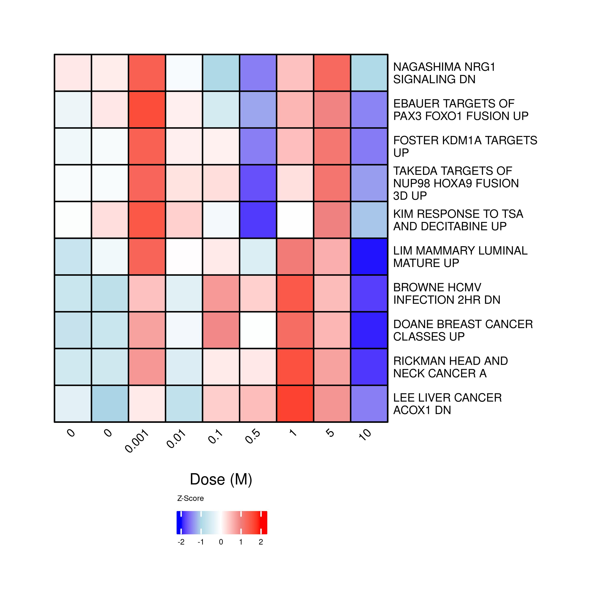
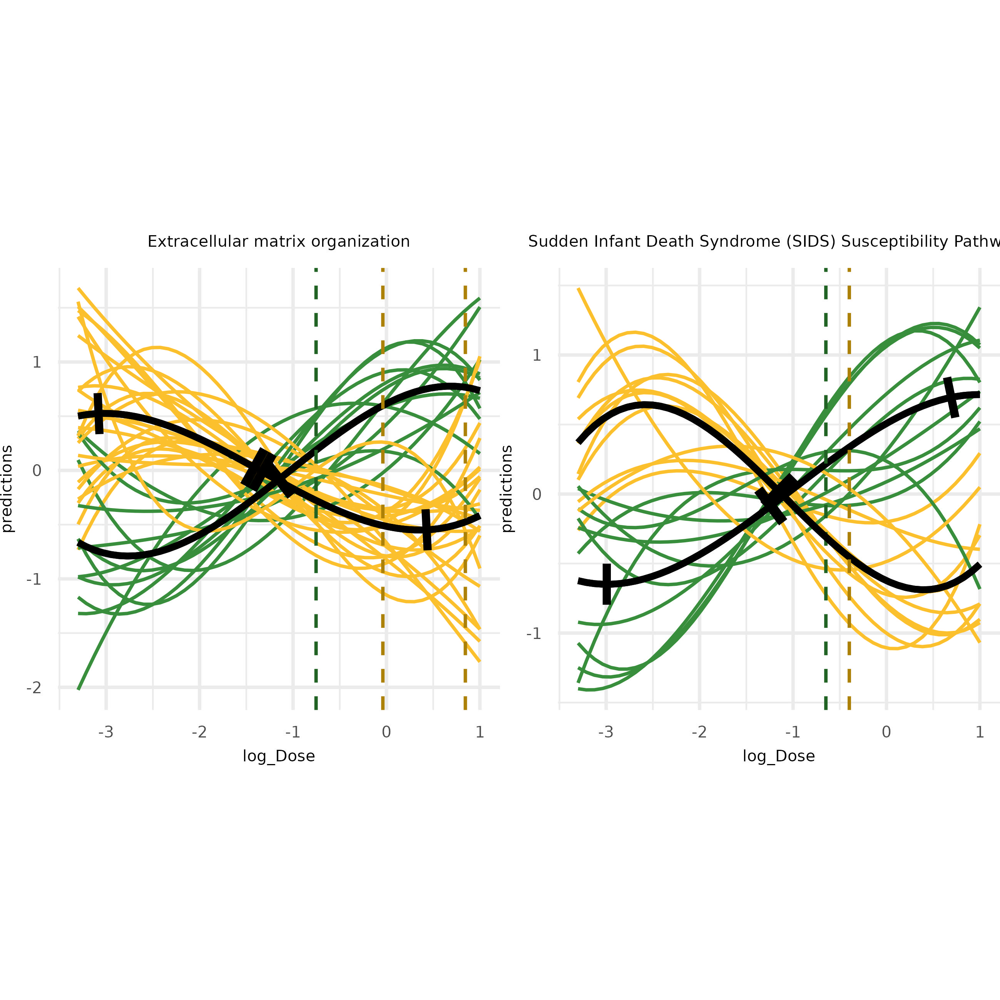
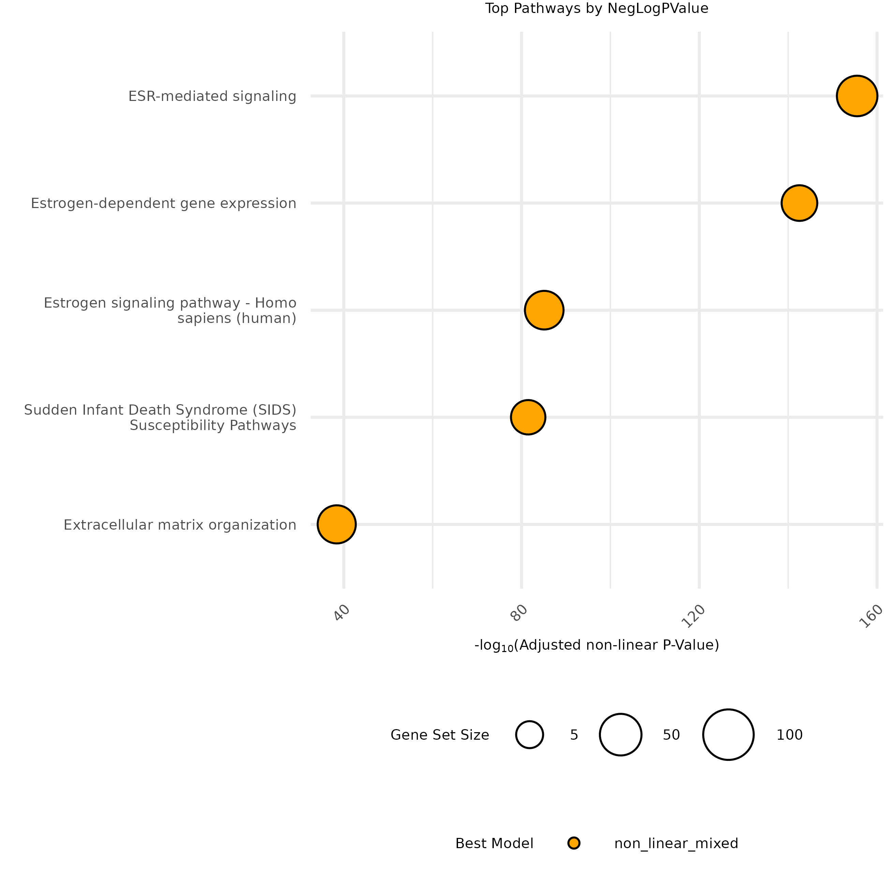
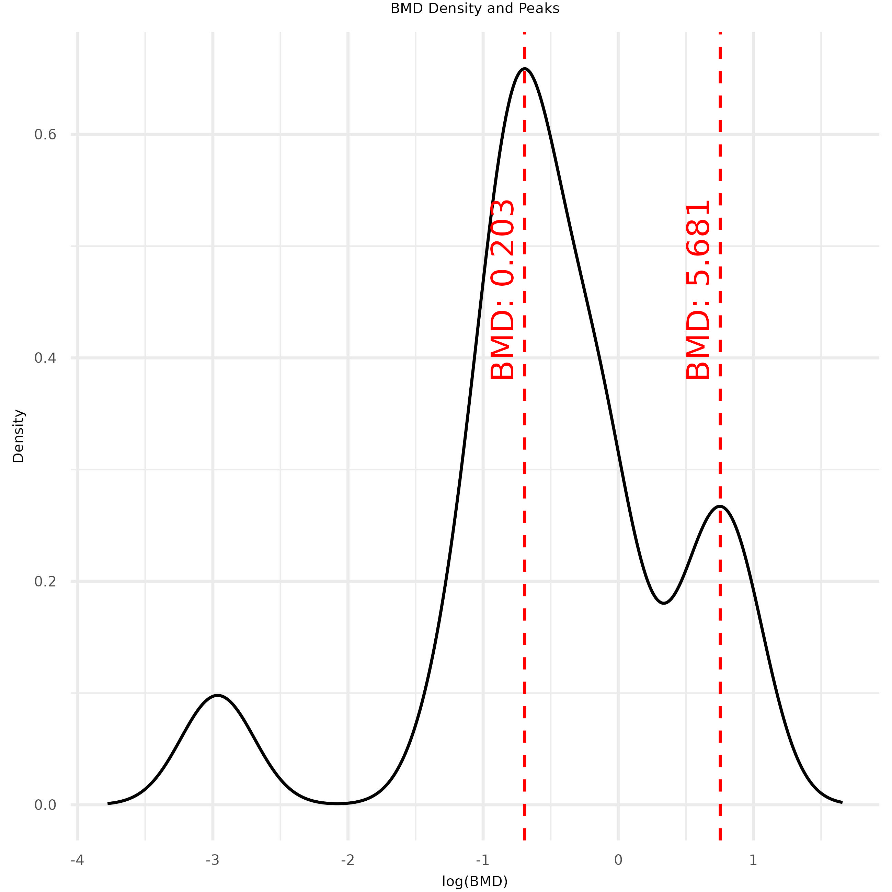
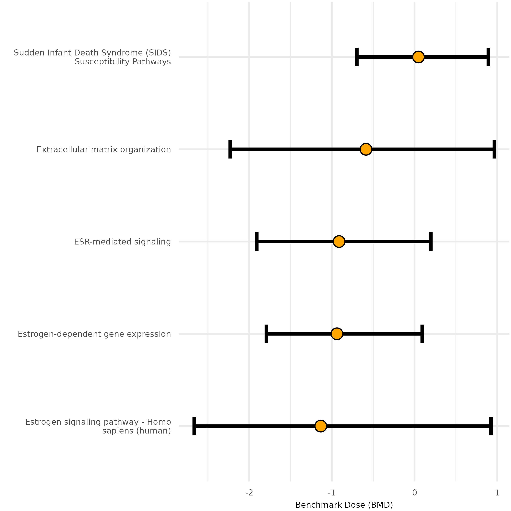

# DoseRider: A multi-omics approach to study dose-response relationships at the pathway level using mixed models

[](https://cran.r-project.org/package=doseRider)
[](https://opensource.org/licenses/MIT)

## Overview

DoseRider enhances toxicogenomics by employing mixed models with cubic splines for the analysis of nonlinear dose-response relationships at the pathway level. This methodology is suitable for multi-omics research and accessible both as an R package and [web application](https://doserider.i-med.ac.at/). It determines pathway trends and calculates Trend Change Doses (TCD) and Benchmark Doses (BMD). DoseRider uncovers essential dose-response pathways and molecular patterns, improving insights into the effects of compounds or drugs at varying doses.

## Key Features

- **Non-linear and Linear Modeling:** Implements linear mixed models with cubic splines and generalized mixed models to accommodate non-linear dose-response relationships.
- **Pathway-Level Dose-Response Modeling:** Models dose-response at the pathway or gene-set level, calculating TCDs and BMDs.
- **Multi-Omics Support:** Compatible with various omics data types, including RNA-Seq and metabolomics.
- **Parallel Computing:** Utilizes parallel processing for efficient handling of large-scale datasets.
- **Visualization Tools:** Multiple built-in plotting functions to visualize dose-response trends and model outputs.
- **Customizable Gene Sets:** Filter and analyze custom or preprocessed gene sets.

## Installation

To install the latest development version from GitHub:

```r
# install.packages("devtools")
devtools::install_github("icbi-lab/doseRider")
```

## Usage Example

Below is a simple example demonstrating the use of DoseRider:


```r
# Load DoseRider
library(doseRider)

# Load your gene expression data
data("bpaf_data")

# Load gene sets
gmt_path <- system.file("extdata", "High-Response-Toxicogenomics.gmt", package = "doseRider")
gmt <- read_gmt(gmt_path)

# Perform dose-response analysis
# Run doseRider analysis
dose_rider_results <- DoseRiderParallel(
  se = bpaf_data, 
  gmt = gmt, 
  dose_col = "Dose", 
  omic = "rnaseq", 
  minGSsize = 20, 
  maxGSsize = 200, 
  method = "fdr", 
  covariates = c(),
  modelType = "LMM", 
  num_cores = 10,
  FilterPathway = TRUE,
  log_transform = TRUE,
  models = c("linear", "non_linear_mixed")
)
```


### Visualization

DoseRider provides various visualizations that offer deep insights into dose-response relationships at the pathway level. Below are a few examples of visualizations that can be generated using the package:

#### 1. Dose Response Heatmap

The dose-response heatmap provides a visual summary of gene expression across doses for the top gene sets, sorted by the adjusted non-linear p-value. The intensity of color in the heatmap represents the magnitude of gene set expression across different doses.

```r
p1 <- dose_response_heatmap(dose_rider_results_filter, dose_col = "Dose", top = 15)
jpeg(file=paste0(save_path, "plot1.jpeg"), width = 10, height = 10, units = "cm", res = 600)
plot(p1, heatmap_legend_side = "bottom", annotation_legend_side = "bottom")
dev.off()
```



#### 2. Gene Set Random Effects Visualization

This plot illustrates the random effects distribution within the top gene sets. It highlights the variability in expression within each gene set in response to different dose levels.

```r
p2 <- plot_gene_set_random_effects(dose_rider_results_filter, dose_col = "log_Dose", top = 15)
ggsave(paste0(save_path, "plot2.jpeg"), plot = p2, width = 10, height = 10, units = "cm", dpi = 600)
```


#### 3. Top Pathway Responses

This plot visualizes dose-response relationships for the top pathways, showing significant dose-dependent expression trends. Each pathway is plotted individually, allowing for the identification of key dose-response effects.

```r
p3 <- plot_top_pathway_responses(dose_rider_results_filter, top = 2, ncol = 2, text_size = 5, dose_col = "log_Dose", clusterResults = TRUE)
ggsave(paste0(save_path, "plot3.jpeg"), plot = p3, width = 10, height = 10, units = "cm", dpi = 600)
```



#### 4. Gene Random Effect Relationship Plot

This plot highlights the relationship between random effects and gene expression within a specific pathway, such as the "Estrogen signaling pathway." It allows for a detailed examination of gene-specific response variability within the pathway.

```r
p4 <- plot_gene_random_effect_relationship(dose_rider_results_filter, "Estrogen signaling pathway - Homo sapiens (human)")
ggsave(paste0(save_path, "plot4.jpeg"), plot = p4, width = 10, height = 10, units = "cm", dpi = 600)
```


#### 5. Top Pathways Dot Plot

The dot plot shows the top pathways ordered by the number of genes, highlighting the gene count and significance of each pathway in response to dose variations.

```r
p5 <- plot_dotplot_top_pathways(dose_rider_results_filter, top = 15)
ggsave(paste0(save_path, "plot5.jpeg"), plot = p5, width = 10, height = 10, units = "cm", dpi = 600)
```



#### 6. Gene Heatmap for a Specific Pathway

This heatmap zooms in on the gene-level expression for a specific pathway, allowing for an in-depth analysis of gene expression trends across different doses.

```r
p6 <- create_gene_heatmap(dose_rider_results_filter, dose_col = "Dose", gene_set_name = "Estrogen signaling pathway - Homo sapiens (human)")
jpeg(file=paste0(save_path,"plot6.jpeg"), width = 10, height = 10, units = "cm", res = 600)
plot(p6, heatmap_legend_side = "bottom", annotation_legend_side = "bottom")
dev.off()
```


#### 7. BMD Density and Peaks

This plot visualizes the density of Benchmark Dose (BMD) values and highlights the peaks, providing insights into dose ranges where the most significant effects occur.

```r
p7 <- plot_bmd_density_and_peaks(data_bmd)
ggsave(paste0(save_path, "plot7.jpeg"), plot = p7, width = PLOT_WIDTH, height = PLOT_HEIGHT, units = units, dpi = 600)
```



#### 8. TCD Density

This plot visualizes the density of Threshold Concentration Dose (TCD) values and highlights the zero points, providing a clear representation of dose intervals with significant changes in response.

```r
p8 <- plot_tcd_density(data_tcd)
ggsave(paste0(save_path, "plot8.jpeg"), plot = p8, width = PLOT_WIDTH, height = PLOT_HEIGHT, units = units, dpi = 600)
```


#### 9. BMD Confidence Intervals

This plot shows the confidence intervals for the top pathways' Benchmark Dose (BMD) values, illustrating the range of dose-response effects across pathways.

```r
p9 <- plot_bmd_confidence_intervals(head(bmd_bounds_df, 20))
ggsave(paste0(save_path, "plot9.jpeg"), plot = p9, width = PLOT_WIDTH, height = PLOT_HEIGHT, units = units, dpi = 600)
```



#### 10. TCD1 Confidence Intervals

This plot focuses on the confidence intervals for the minimum Threshold Concentration Dose (TCD1) values for each pathway, highlighting dose-response thresholds at the most sensitive levels.

```r
p10 <- plot_tcd1_confidence_intervals(bmd_bounds_df)
ggsave(paste0(save_path, "plot10.jpeg"), plot = p10, width = PLOT_WIDTH, height = PLOT_HEIGHT, units = units, dpi = 600)
```


### Toxicogenomics Gene Set

The **Toxicogenomics Gene Set** within DoseRider focuses on pathways that exhibit significant changes across compounds from the TG-GATES database. The score is calculated by multiplying NES by the negative logarithm of the p-value for each compound and dose level. The scores are then averaged across doses to generate Z-score normalized weights.


## Contributing

Contributions are welcome! If you find any bugs or have suggestions for new features, please open an issue or submit a pull request on our [GitHub repository](https://github.com/icbi-lab/doseRider).

## License

DoseRider is licensed under the MIT License. See the [LICENSE](LICENSE) file for more details.
