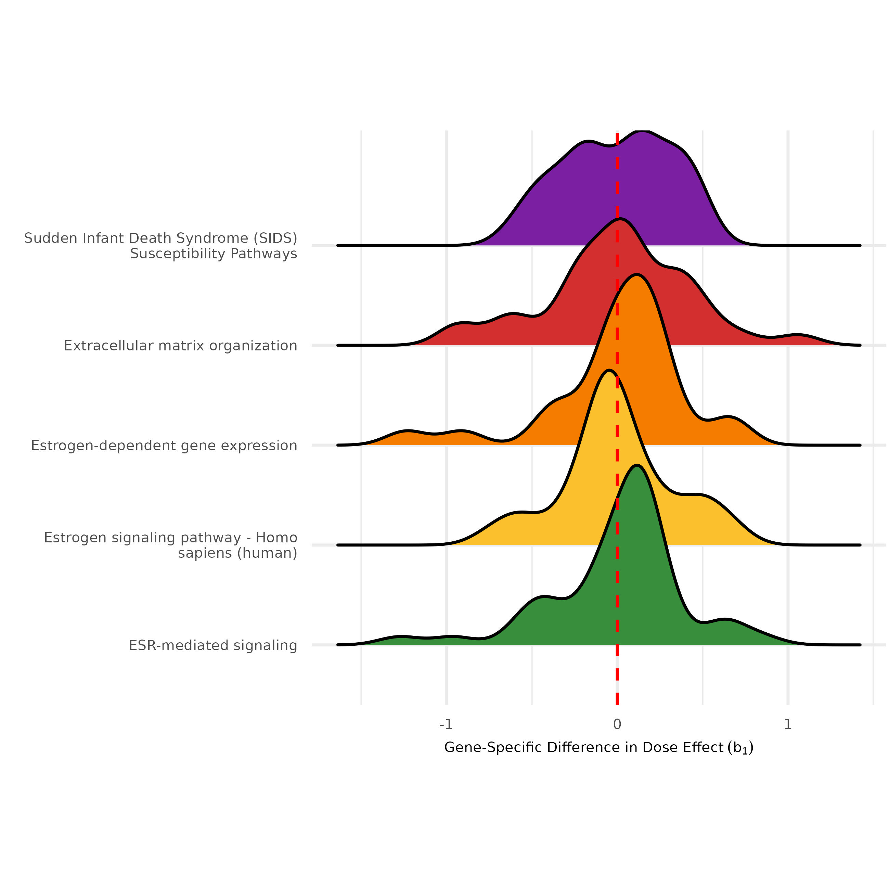

# DoseRider: A multi-omics approach to study dose-response relationships at the pathway level using mixed models

[](https://cran.r-project.org/package=doseRider)
[](https://opensource.org/licenses/MIT)

## Overview

DoseRider enhances toxicogenomics by employing mixed models with cubic splines for the analysis of nonlinear dose-response relationships at the pathway level. This methodology is suitable for multi-omics research and accessible both as an R package and [web application](https://doserider.i-med.ac.at/). It can determine pathway trends and calculate the trend change doses (TCD) and benchmark doses (BMD). DoseRider uncovers essential dose-response pathways and molecular patterns, improving insights into the effects of compounds or drugs at varying doses.

## Key Features

- **Versatile Modeling Capability:** Implements Linear Mixed Models with cubic splines and Generalized Mixed Models to accommodate non-linear dose-response relationships.
- **Breakpoint Identification:** Determines significant breakpoints in dose-response curves to identify critical dose levels impacting gene expression.
- **Multi-Omic Approach:** Adapts to various omics data, including RNA-Seq and microarray, ensuring robust analysis across different technologies.
- **Automatic Model Selection:** Dynamically selects the most appropriate model between null, linear, and non-linear models.
- **Omics-Specific Distribution Selection:** Automatically chooses Gaussian or negative binomial distributions based on the omic technology used, enhancing analysis accuracy.
- **Parallel Processing:** Utilizes parallel computing for efficient processing of large-scale datasets.
- **Curated Gene Sets:** Provides preprocessed and customizable gene sets and pathway databases, facilitating streamlined dose-response analyses.

## Installation

To install the latest development version from GitHub, use the following commands:

```R
# install.packages("devtools")
devtools::install_github("icbi-lab/doseRider")
```

## Usage Example

Below is an example workflow demonstrating the use of DoseRider:

```R
# Load the doseRider package
library(doseRider)

# Example: Reading gene expression data as a SummarizedExperiment object
data <- readRDS("gene_expression_data.rds")

# Load gene set collections
gmt <- loadCPDB("Symbol")

# Filter gene sets by size
gmt_filtered <- filter_gmt_by_size(gmt, minGenesetSize = 10, maxGenesetSize = 50)

# Perform dose-response analysis
dose_rider_results <- DoseRiderParallel(se = data, gmt = gmt_filtered, dose_col = "dose", 
                            sample_col = "sample", omic = "rnaseq", minGSsize = 10, 
                            maxGSsize = 200, num_cores = 4, modelType = "LMM")
```

### Visualization

Visualizations in DoseRider provide insightful representations of the dose-response data. The package offers various plotting functions to explore and interpret the results effectively. Here’s an overview of some key visualizations:

1. **Dose Response Heatmap:**

```{r}
p1 <- dose_response_heatmap(dose_rider_results, dose_col = "Dose", top = 15, order_column = "Adjusted_non_linear_P_Value", decreasing = F)
```

This heatmap illustrates the average gene expression across doses for the top 15 gene sets, with color intensity representing the expression magnitude. It aids in visualizing gene set responses to dose variations.


2. **Gene Set Random Effects Visualization:**

```{r}
p2 <- plot_gene_set_random_effects(dose_rider_results, dose_col = "Dose", top = 15)
```

This plot visualizes the random effects distribution within the top 15 gene sets, highlighting expression variability within each set.



3. **Top Pathway Response Visualization:**

```{r}
p3 <- plot_top_pathway_responses(dose_rider_results, top = 9, ncol = 3)
```

These plots present the dose-response relationship for the top 9 pathways, showcasing significant dose-dependent expression trends.


4. **Gene Random Effect Relationship Plot:**

```{r}
p4 <- plot_gene_random_effect_relationship(dose_rider_results, "Androgen receptor signaling pathway")
```

This visualization displays the relationship between gene random effects and their expression in the "Androgen receptor signaling pathway".


5. **Top Pathways Dot Plot:**

```{r}
p5 <- plot_dotplot_top_pathways(dose_rider_results, top = 15, order_column = "Genes", decreasing = T)
```

A dot plot showing the top 15 pathways sorted by gene count, facilitating a quick comparison of pathway significance and gene involvement.


6. **Gene Heatmap for Specific Pathway:**

```{r}
p6 <- create_gene_heatmap(dose_rider_results, dose_col = "Dose", gene_set_name = "Androgen receptor signaling pathway")
```

A heatmap providing an in-depth look at gene expression within the "Androgen receptor signaling pathway" across different doses.


### Toxicogenomics Gene Set

The **Toxicogenomics Gene Set** within DoseRider focuses on genes identified from the Consensus Path Database (CPDB) that exhibit significant changes across all compounds present in the TG-GATES database. This curated gene set emphasizes the most responsive genes involved in toxicological responses, facilitating a targeted approach in dose-response analysis.

Scores were calculated by multiplying NES by the negative logarithm of the p-value for each compound and dose level, emphasizing gene sets with significant and robust expression changes. These scores were then averaged across dose levels per compound, and a final normalization step across all compounds produced Z-score normalized weights. This process prioritizes gene sets by their responsiveness to toxicological exposure across the dataset.


## Upcoming Features

- Cumulative Distribution Function plots for a detailed analysis of the distribution of random effects, aiding in the identification of outlier genes or unusual patterns.

## Contributing

We welcome contributions to DoseRider! If you find bugs, have feature requests, or want to contribute to the development, please open an issue or submit a pull request on our [GitHub repository](https://github.com/icbi-lab/doseRider).

## License

DoseRider is licensed under the MIT License. For more details, see the [LICENSE](LICENSE) file.
