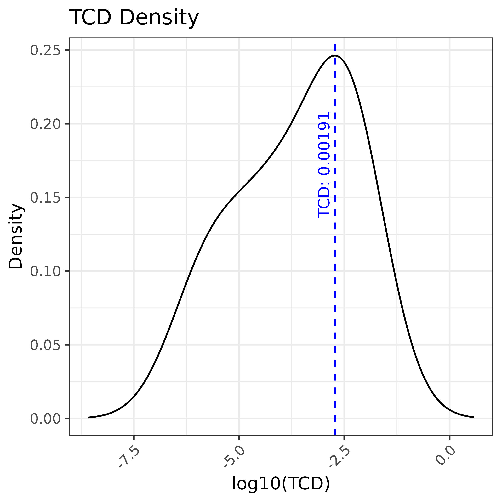
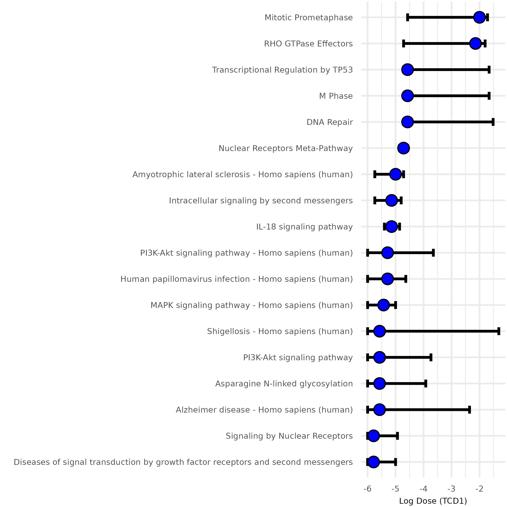

# DoseRider: A multi-omics approach to study dose-response relationships at the pathway level using mixed models

[](https://cran.r-project.org/package=doseRider)
[](https://opensource.org/licenses/MIT)

## Overview

DoseRider enhances toxicogenomics by employing mixed models with cubic splines for the analysis of nonlinear dose-response relationships at the pathway level. This methodology is suitable for multi-omics research and accessible both as an R package and [web application](https://doserider.i-med.ac.at/). It determines pathway trends and calculates Trend Change Doses (TCD) and Benchmark Doses (BMD). DoseRider uncovers essential dose-response pathways and molecular patterns, improving insights into the effects of compounds or drugs at varying doses.

## Key Features

- **Non-linear and Linear Modeling:** Implements linear mixed models with cubic splines and generalized mixed models to accommodate non-linear dose-response relationships.
- **Pathway-Level Dose-Response Modeling:** Models dose-response at the pathway or gene-set level, calculating TCDs and BMDs.
- **Multi-Omics Support:** Compatible with various omics data types, including RNA-Seq and metabolomics.
- **Parallel Computing:** Utilizes parallel processing for efficient handling of large-scale datasets.
- **Visualization Tools:** Multiple built-in plotting functions to visualize dose-response trends and model outputs.
- **Customizable Gene Sets:** Filter and analyze custom or preprocessed gene sets.

## Installation

To install the latest development version from GitHub:

```r
# install.packages("devtools")
devtools::install_github("icbi-lab/doseRider")
```

## Usage Example

Below is a simple example demonstrating the use of DoseRider:


```r
# Load DoseRider
library(doseRider)

# Load your gene expression data
data("bpaf_data")

# Load gene sets
gmt_path <- system.file("extdata", "High-Response-Toxicogenomics.gmt", package = "doseRider")
gmt <- read_gmt(gmt_path)

# Perform dose-response analysis
# Run doseRider analysis
dose_rider_results <- DoseRiderParallel(
  se = bpaf_data, 
  gmt = gmt, 
  dose_col = "Dose", 
  omic = "rnaseq", 
  minGSsize = 20, 
  maxGSsize = 200, 
  method = "fdr", 
  covariates = c(),
  modelType = "LMM", 
  num_cores = 10,
  FilterPathway = TRUE,
  log_transform = TRUE,
  models = c("linear", "non_linear_mixed")
)
```


### Visualization


DoseRider provides a comprehensive suite of visualizations to explore dose-response relationships at both the dataset and pathway levels. Visual outputs are organized below and are automatically generated for each analysis.

---

### Dataset-Level Visualizations

These plots summarize dose-response behavior across all significant pathways:

---

#### 1. Dotplot of Top Pathways

Ranks top pathways by -log₁₀(adjusted p-value). Dot size and position reflect significance and pathway size.

```r
p1 <- plot_dotplot_top_pathways(dose_rider_results_filter, top = 10)
```


---

#### 2. Dose Response Heatmap

Visualizes average expression across doses for top pathways. Intensity shows magnitude of response.

```r
p2 <- dose_response_heatmap(dose_rider_results_filter, dose_col = "Dose", top = 10)
```


---

#### 3. Gene Set Random Effects

Displays gene-specific deviations within each pathway using mixed-model random effects.

```r
p3 <- plot_gene_set_random_effects(dose_rider_results_filter, dose_col = "log_Dose", top = 10)
```


---

#### 4. Top Pathway Responses

Shows modeled expression curves for top pathways based on spline fits.

```r
p4 <- plot_top_pathway_responses(dose_rider_results_filter, top = 8, dose_col = "log_Dose", clusterResults = TRUE)
```


---

#### 5. BMD Density and Peaks

Displays the distribution of Benchmark Dose (BMD) values across pathways, highlighting sensitive dose regions.

```r
data_bmd <- get_bmd_range(dose_rider_results_filter)
p5 <- plot_bmd_density_and_peaks(data_bmd)
```


---

#### 6. TCD Density and Peaks

Plots the distribution of Trend Change Doses (TCDs), where expression curves shift direction.

```r
data_tcd <- get_tcd_range(dose_rider_results_filter)
p6 <- plot_tcd_density(data_tcd)
```



---

#### 7. BMD Confidence Intervals

Bootstrap-based 95% confidence intervals for BMD values of top pathways.

```r
p7 <- plot_bmd_confidence_intervals(head(bmd_bounds_df, 20))
```


---

#### 8. TCD Confidence Intervals

Bootstrap-based 95% confidence intervals for TCD1 values of top pathways. 


```r
p8 <- plot_tcd1_confidence_intervals(bmd_bounds_df)
```



---

###  Pathway-Level Visualizations

These plots give insight into individual pathways.

---

#### 9. Gene Random Effect Relationship

Shows expression variability and random effect strength for a selected pathway.

```r
p9 <- plot_gene_random_effect_relationship(dose_rider_results_filter, "Estrogen signaling pathway - Homo sapiens (human)")
```


---

#### 10. Gene-Level Heatmap

Heatmap of individual gene expression across doses for a selected pathway.

```r
p10 <- create_gene_heatmap(dose_rider_results_filter, gene_set_name = "Estrogen signaling pathway - Homo sapiens (human)")
```


---

### Toxicogenomics Gene Set

The **Toxicogenomics Gene Set** within DoseRider focuses on pathways that exhibit significant changes across compounds from the TG-GATES database. The score is calculated by multiplying NES by the negative logarithm of the p-value for each compound and dose level. The scores are then averaged across doses to generate Z-score normalized weights.

You can download the GMT file directly from the repository:

**[📂 Download GMT file](./inst/extdata/High-Response-Toxicogenomics.gmt)**  
(Path: `inst/extdata/High-Response-Toxicogenomics.gmt`)

#### Visualization Example

The heatmap below shows weighted scores across TG-GATES compounds, illustrating the most responsive pathways:


## Contributing

Contributions are welcome! If you find any bugs or have suggestions for new features, please open an issue or submit a pull request on our [GitHub repository](https://github.com/icbi-lab/doseRider).

## License

DoseRider is licensed under the MIT License. See the [LICENSE](LICENSE) file for more details.
